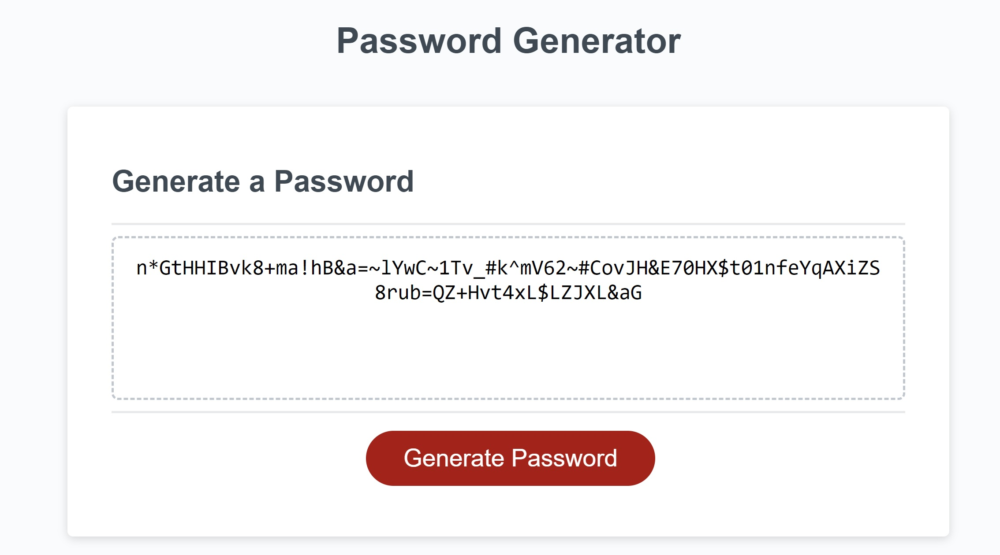

# password-generator

## Description

I was asked to create a web application that generates a safe and secure password, using JavaScript, for employees with senstive digital information. I was given HTML code, a CSS stlye sheet, and a JavaScript file with starter code and I made that into a working password generator.The user asked that the password be between 8 and 128 characters long and can contain lowercase letters, uppercase letters, special characters, and numbers. The user asked that the password must contain at least one of these character types. The starter code and original site are shown below 

I achieved this using two functions, one to prompt the user to generate character types and length, and one to write the password in the textbox. First I wrote confirm statements for the user to choose the characters they'd like to use in their password as well as their password length as illustrated in the below screenshot.
  "Password Prompts and confirms"

After that I made an array for each character type to collect and output the users inputs. I used the arrays below.

Next I added if statements to construct a larger array called "options" based on the users previeous prompt inputs

Then I wrote a loop to calculate the password length and generate a password using the array "options" represented by the parameter "random" as shown in the image below.

I used the return function to hoist the value of "random" into the original 'generatePassword' function. That passed our value into the "writePassword" function. This wrote the password into the textbox using the eventlistener I was given in the starter code which ran the "writePassword" function, which in turn passed the final value that represents the password into our textbox. The result is shown below 

This web application will function on mobile devices

## Installation

NA

## Usage

To use this application the press the "Generate Password" button to prompt the user to choose character types and password length as demonstrated step by step below

First the page prompts the user to pick character types and password length

Character Prompt:
[!Alt text](assets/character-prompt.jpg)

Length Prompt:
[!Alt text](assets/length-prompt.jpg)

If the user fails to choose a character to include in their password the prompt below displays
[!Alt text](assets/no-characters-selected.jpg)

After all the character values and password length prompts are filled out by the user a safe secure password is generated using the parameters given

Generated Password:
[!Alt text](assets/genned-pass.jpg)

## Features

This password generator generates a unique password on button between 8 and 128 characters using the users choice of any combination of lowercase letters, uppercase letters, special characters, and numbers. The user may also choose the password length. This password generator prompts the user to easily input character types and password length and even alerts the user if no character types were selected. The generator also will not generate a password if fed a number between 8 and 128 characters

## Sources

https://www.youtube.com/watch?v=x4HUaiazDes
https://stackoverflow.com/questions/64378165/why-is-my-password-returning-as-undefined 
Was helped by my tutor Scott McAnally to make password generator function
Used help from my instructor JD Tadlock

## Tests 
To test this web application click "OK" on any combination of character types. It will generate a password using those character types
To test this web application type in any number between 8 and 128 into the password length prompt and it will generate a password with said number of characters
To Test this web application click "cancel" on all four character type prompts and you will be prompted to select a character type and a password will not generate
To test this web application type any number less than 8 and more than 128 into the password length prompt box and no password will be generated 
To test this web application open the page on any mobile device and it will function

I personally tested this application many times
